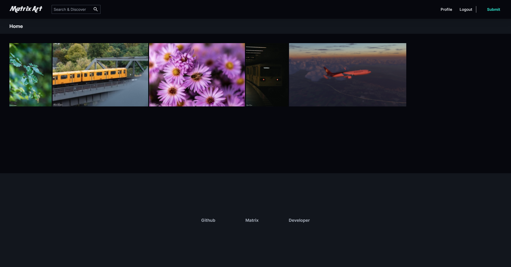

 

# Matrix-Art

Matrix Art is an experimental Devianart Fediverse version which tries to be close to Devianart.

## Concept (roughly)

https://scythe-pink-090.notion.site/Art-MX-Fediverse-Devianart-148d45b596e74582acff518baadd3026

## Demo Page

https://art.midnightthoughts.space/

## How to install

### Prerequisites 

- Nodejs
- A Matrix Server with public registration
- A Matrix Server with guests enabled
- A Matrix Server with dynamic thumbnails
- A Meillisearch server (See https://meilisearch.com for more information)

### Steps

1. Copy the `.env.local.example` to `.env.local` or set the `NEXT_PUBLIC_DEFAULT_SERVER_URL` variable.
2. Run `npm run dev` or build and run the Dockerimage

## Translations

Translations can be contributed via https://trans.nordgedanken.dev/projects/matrix-art/matrix-art/

